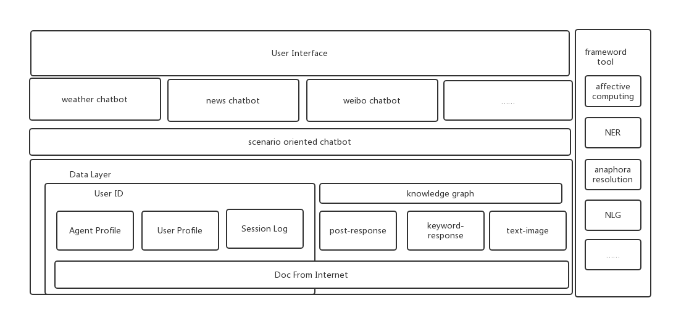
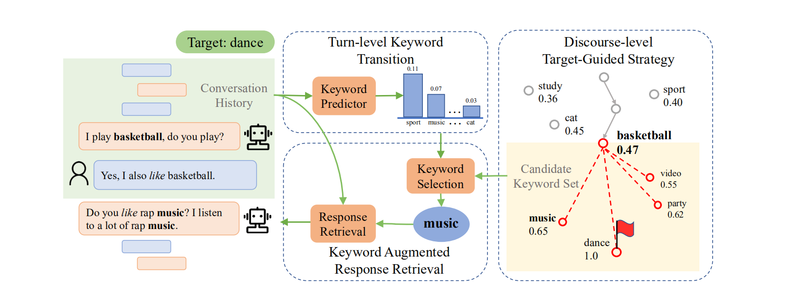
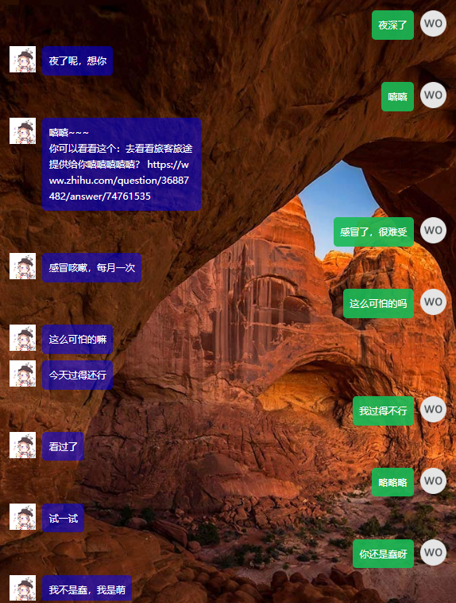
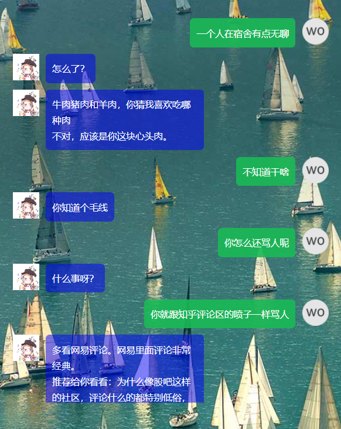
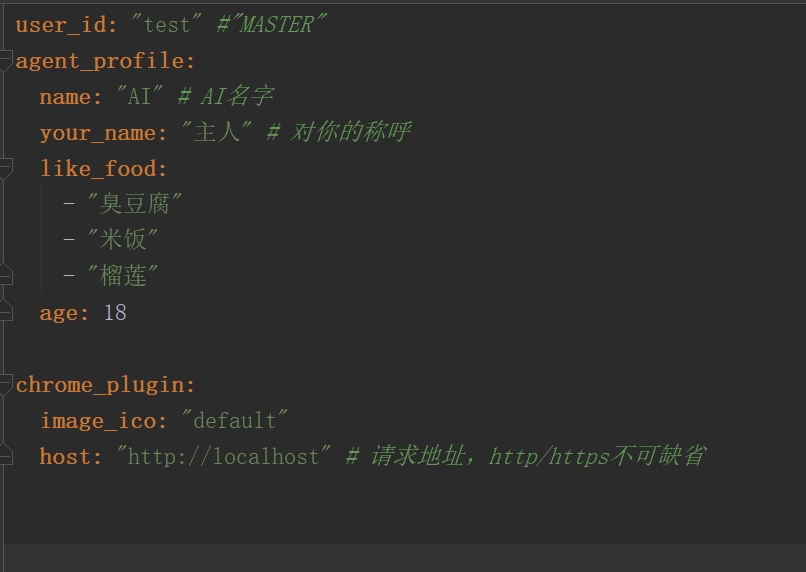

# KnowYouAI :robot:

# 

知你（Knowyou）是一个基于python开发的Chat Bot框架，以user_id区分,为每一个用户创立个性化AI。

支持用户设定Agent Profile,同时在聊天的过程中AI会学习你说的话，根据浏览器插件来捕获你在浏览器上的浏览记录，记录你对话过程中常提及的事情和时间，从而构建User Profile。

KnowYou也支持情感计算（Affective Computing），更好捕获用户的情感和表达agent的情感（部分行为会因agent对你的好感度数值而有所不同，比如撒娇，土味情话，发表情包等）。

上述描绘的三者 ，即Agent Profile，User Profile，Affective Computing是KnowYou的主打方向和基础技术，全部由作者自行编写，参与在对话生成，排序等多方面。

项目整体架构如下图：

语料数据来源 [github](https://github.com/brightmart/nlp_chinese_corpus) 和思知

------

## :star: Feature

- open domain 不能太open（**key idea**）

  目前来说，市面上的提供闲聊机器人只能做毫无意义的闲聊，很难进行具体场景的展开。

  因此作者参考了论文【1】Target-Guided Open-Domain Conversation，该论文提出了任务导向的open domain的聊天机器人。

  简单点来说，过往的设计都集中在怎么获取用户的Intent，AI只能跟着用户跑，所以在open domain上用户的Intent选择空间无穷大，数据集和规则都很难覆盖全面，很容易就出现了AI前言不搭后语等情景。

  **但比较人与人之间的聊天，每一个具体场景的聊天其实都有潜在目的，比如心理医生和病人聊天是为了询问病情，你听朋友倾诉最后目的是为了安慰，导师和学生聊天是为了激发灵感，年轻男女聊天是为了互相了解等。所以一个基本的聊天过程可以分为情景相关的目的和增加为了聊天连续相关的，后者指的是比如一些打趣，卖萌的话，也是目前主流闲聊机器人所能达到的水平，而人的常识也知道，仅靠打趣卖萌是无法长时间维持聊天的，而该论文则是针对这点，提出了一个由AI引导的情景相关的聊天的方法。**

  论文为AI设立了一个和用户第一次post的内容相关的target，然后再对话过程中，引导话题向target上靠，使得对话的上下文的选择都在某个可控范围之内。相比随便聊，对话要更加平滑自然。

  

  ​										（图来自【1】Target-Guided Open-Domain Conversation）

  但论文提出的target是随机的，而且只是一个key word。**KnowYou对此进行修改，将target改成了某个cQA数据集上一条链接上的主题词，话题到达target后，AI自动分享该链接并评论，让对话过程更加拟人化**

  

- 可拓展性

  KnowYou的理念是**平台提供机制和工具，小bot组合成大bot**。用户可以自行参考KnowYou自带的几个小bot的实现过程，实现自己的bot，拓展AI的功能。其中上面提及的情景导向聊天，亦是以小bot的形式实现。

- 鹦鹉学舌

  用户和agent历史对话将成为新一轮对话中的检索样本（与user_id相关），从而覆盖语料库中的没有的长尾样本。

- 主动搭话

  主动对话包括主动引导聊天话题，表达自身心情等。避免传统chatbot一问一答的形式，让聊天丝一般的润滑。

- 支持多用户平台

  支持微信公众号，web等。微信公众号在主动搭话方面有诸多限制，所以主打自建的web平台，后续可能会考虑独立APP

## :star2: ​Example

以web平台的交互为例（背景用的必应的，所以会变）

情景导向只是给予了上下文话题的一个约束，具体的回答仍然要依赖于现在NLG技术，而且中文的对话语料大多不合人意，所以还有很大的优化空间。但至少论文【1】提出的情景导向框架，我个人觉得值得follow。不出意外KnowYou将会很长时间使用在这种框架下进行进一步的开发。

## :yum: ​技术简述（浓缩版）

- NLP技术：

  TF-IDF  

  HMM分词 

  词性标注

  正则表达式

  线上字典做实体识别

  情感字典

- Deep NLP

  构建embedding进行语义计算

  候选回答匹配

  构建线上实体识别的字典

- 知识图谱

  关系推理

  构建实体识别的字典

  知识问答

- 对话

  基于检索 【2】

  基于网络文本  【3】

  基于生成  

##  :couple:Requirements

- python 3.6+ 
- Neo4J
- 其余见requirements.txt

## :floppy_disk: How To Use

因为文件太大不可在github上分享，请在百度云上下载完整版（含db文件，训练的模型等）：

链接：https://pan.baidu.com/s/1AEDYqfyEuwqTSKy8o5sjdA 
提取码：neq3 

复制这段内容后打开百度网盘手机App，操作更方便哦

然后把graph文件放在你的neo4j对应的目录上。

config.py是面向开发者的配置

1.首先进行依赖的安装

> pip install -r requirements.txt

​	其中pytorch可能需要到官网进行进行下载

我这里的环境pytorch是0.4，但理论上pytorch0.4 +应该都可用

[pytorch官网](https://pytorch.org/)

2.打开build.conf，配置你的个性ai

​	emmm……看字段名字应该就知道是什么意思了。

​	这些字段不是固定的，用户可以人工添加，比如示例中有like_food，你可以自己添加like_people字段，但如果需要表达这个是”喜欢“的东西，字段名中需要含有“like”字眼（暂时不支持其他情绪）

​	目前agent profile发挥的作用其实很有限，只是为未来预留了接口。

​	然后再命令行上输入python build.ai后，只需等待片刻，再UserData中就会开辟出你的存储空间，你的chrome插件可在里面找到。

3 .  python server.py启动服务器 （ 需要先启动neo4j ）

​	示例中只是用了flask的内置服务器，如果有其他需要请自行配置。

4.最后，在命令行输入python get_talk_url.py your_user_id，将后面输出的url复制到浏览器即可。

​	注意的是，这个url中key参数并没有起到password的作用（更像是一个动态口令），只是一个随机的字符串组合，用于避免别人直接输入你的user_id就可以访问到你的ai（而你通过调用脚本自然可以获得该口令），你可以记忆，也可以每次都用新的key

## :rainbow:捐款和交流

想买服务器把她部署上去，让大家都能使用，可是没有钱。

不仅连自己的房子买不起，连AI的房子我也买不起。

如果你也认同我的开发理念和本项目，能资助我几个小钱钱就更好了，金额不限，谢谢

如有问题和技术交流，请开issue。

## :runner:TODO

未来，KnowYou会支持从大量文本（如网络小说）中直接构建agent profile。

更丰富的情感计算功能，包括识别和表达。

支持多模态等。

## :jack_o_lantern: Reference paper

【1】**Target-Guided Open-Domain Conversation**（ACL 2019）

  <https://arxiv.org/pdf/1905.11553.pdf>

【2】**An Information Retrieval Approach to Short Text Conversation**

 <https://arxiv.org/pdf/1408.6988.pdf>

【3】**Docchat- An information retrieval approach for chatbot engines using unstructured documents **

【4】 **The Design and Implementation of XiaoIce,** **an Empathetic Social Chatbot** 

## :rocket: Other

项目还处于开发期，纯粹个人爱好（有生之年系列），因此文档等很多都在路上，见谅。

如果本项目对你的工作或研究产生了正面影响，希望你能在一些场合，提一下该项目，比如友情链接等。

欢迎交流指正。

